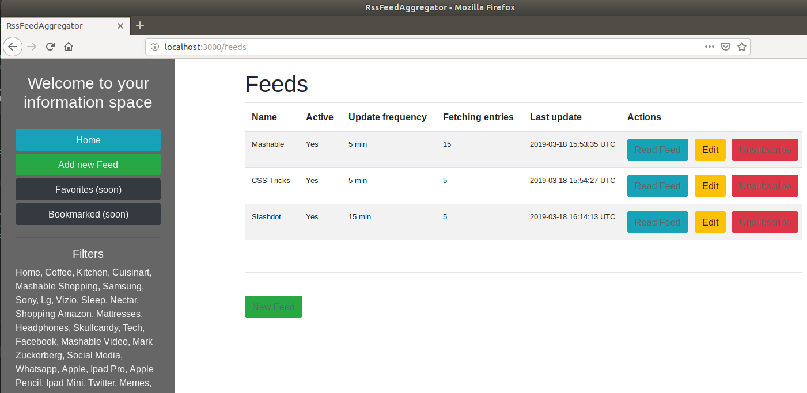

# README

## Set up
- `bundle install`

- `sudo -u postgres psql`  (provided PSQL is installed)

- > `CREATE DATABASE rss_feeder_development;`
- > `CREATE DATABASE rss_feeder_test;`

- > Exit PSQL with CTRL+Z

- `rake db:migrate`

- `rake db:seed`

- `rails s`

Visit `localhost:3000`

## Starring
- postgresql
- feedjira
- slim
- jquery-rails
- sidekiq
- sidekiq-cron

## Mechanics
tbc